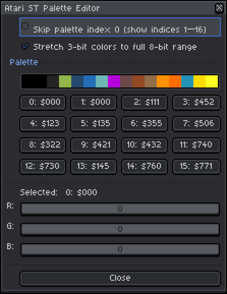

# Aseprite Atari ST Palette Editor Plugin

An [Aseprite](https://www.aseprite.org/) plugin for editing sprite palettes using the Atari ST's 3-bit-per-channel RGB color model.

| | |
|---|---|
| **Plugin** | Atari ST Palette Editor |
| **Version** | Beta 2 |
| **Author** | [sandord](https://github.com/sandord) |
| **License** | MIT |
| **AI Assisted** | Yes — code generated with AI help |

## Why?

Because editing Atari ST palettes in Aseprite can be cumbersome without a dedicated tool. Because Aseprite uses 8 bits per channel (0–255) while the Atari ST's palette hardware uses only 3 bits per channel (0–7), it can be hard to know if the ST can display a given color.

## Screenshot

## Installation

1. Open Aseprite
2. Go to **File → Scripts → Open Script Folder**
3. Open a second file explorer and browse to and select the `atari-st-palette` folder in this repository
4. Copy the `atari-st-palette` folder into the script folder you opened in step 2

## Usage

1. Open any sprite in Aseprite
2. Run the plugin from **File → Scripts → Atari ST Palette Editor**
3. **To pick a color**: click its corresponding button
4. **To fine-tune**: use the R, G, B sliders (each 0–7) to adjust the selected slot with Atari ST precision
5. **Skip first**: check "Skip palette index 0" to shift all slots up by one, leaving palette index 0 untouched. This can be useful for assets that use index 0 for transparency.
6. **Stretch mode**: check "Stretch 3-bit colors to full 8-bit range" for maximum dynamic range (0–255); uncheck for a simple bit-shift mapping (0–224) that matches the raw hardware output. This ensures that the colors are displayed with proper brightness in Aseprite.

All changes are written to the active sprite's palette immediately. The dialog is modal — close it when you are done.

## Limitations

Due to limitations of the Aseprite scripting API, this plugin has user interface constraints:
- The color preview strip cannot be used to select a color. Use the corresponding buttons instead.

## About Atari ST Colors

The Atari ST's color hardware uses **9 bits of color information** — 3 bits each for red, green, and blue — for a total of **512 possible colors** (8×8×8). Each channel ranges from 0 to 7. The machine's palette registers store 9-bit color values and output them to the screen through three 3-bit DACs.

Aseprite uses 8 bits per channel (0–255), so this plugin converts between the two:

| Mode | 3-bit 0 | 3-bit 7 | Mapping |
|---|---|---|---|
| **Stretch on** | 0 | 255 | Bit replication: `(v<<5) \| (v<<2) \| (v>>1)` |
| **Stretch off** | 0 | 224 | Simple shift: `v << 5` |

Stretch mode fills the entire 0–255 range, which is generally preferred for modern displays. Disabling stretch gives you the raw hardware values (max 224) which may be useful when matching emulator output or legacy assets exactly.

## Requirements

- **Aseprite v1.3** or later

## License

MIT — see the [package.json](atari-st-palette/package.json) file for details.